# Digital Logic Design Lab
Time : 2021 spring (second half semester of sophomore)

## lecture

|subject|teacher|
|:-:|:-:|
|[邏輯系統實驗](http://class-qry.acad.ncku.edu.tw/syllabus/online_display.php?syear=0209&sem=2&co_no=E211600&class_code=1)|[林輝堂](https://www.ee.ncku.edu.tw/teacher/index2.php?teacher_id=43)|

<br>

## Report
> more info in doc/*.pdf
- [lab01](#lab01)
- [lab02](#lab02)
- [lab03](#lab03)
- [lab04](#lab04)
- [lab05](#lab05)
- [lab06](#lab06)
- [lab07](#lab07)
- [lab08](#lab08)
- [lab09](#lab09)
- [lab10](#lab10)
- [lab11](#lab11)
- [lab12](#lab12)
- [lab13](#lab13)

<br>

## Environment
1. OS
- `Windows 10 21H1`

2. Hardware and software
### lab01-03
- breadboard and wire
- IC7404, IC7408, IC7432, IC7402
- Seven-segment display
### lab 04-05, 11-13
- `Modelsim 10.1c`
### Lab 06-10
- `HDL Auto Assign pin` (`*v`->`*ucf`)
- `ISE Project Navi` (`*v`,`*ucf`->`*.bit`)
- `SMIMS FPGA programmer`(`*.bit`->`FPGA`)
- [`VeriLite Xilinx SP6`](http://tw.smims.com.tw/index.php?active=ProductItem&item=8)
- [`VeriInstrument`](http://tw.smims.com.tw/index.php?active=ProductItem&item=18)


<br>

## How to Run (lab 04-05, 11-13)
> more intro is my article [如何使用Modelsim進行數位電路模擬](https://hackmd.io/@HsuChiChen/modelsim) 

1. download repo
```
git clone https://github.com/HsuChiChen/logic-design.git
```
2. open `Modelsim v10.1c`
```
modelsim
```
3. cd to  working directory
```
cd {working directory}
```
4. create work file
```
vlib work
```
5. compile all `*.v` file
```
vlog *.v
```
6. right click `testbench` in `work`file and choose `Simulate Without Optimatization`

7. `drag and drop` the signal you want to observe to `wave` panel

8. run
```
run 10000000ns
```

<br>

## lab01
### 內容
1. X NOR gate
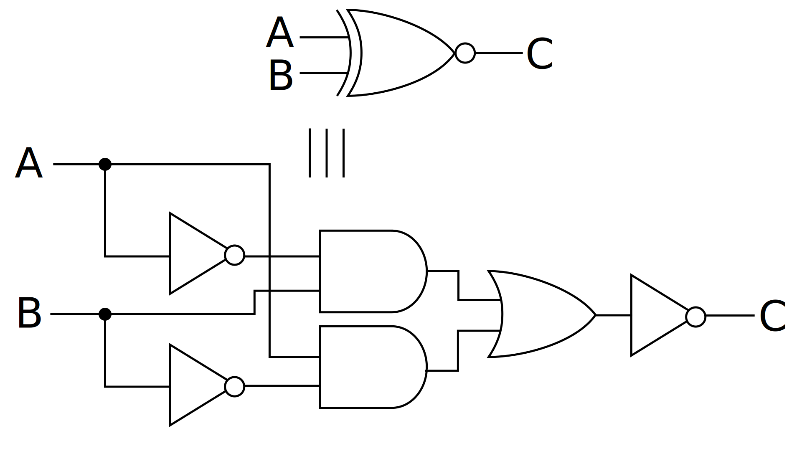
2. 通用閘-NAND
    - NAND gate → NOT gate
    - NAND gate → AND gate
    - NAND gate → OR gate
    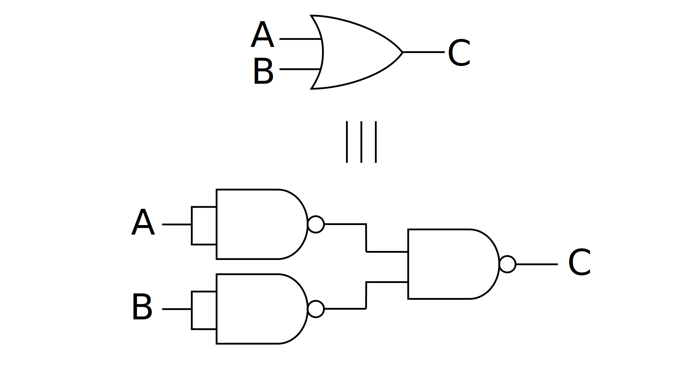
3. 通用閘-NOR
    - NOR gate → NOT gate
    - NOR gate → AND gate
    - NOR gate → OR gate
    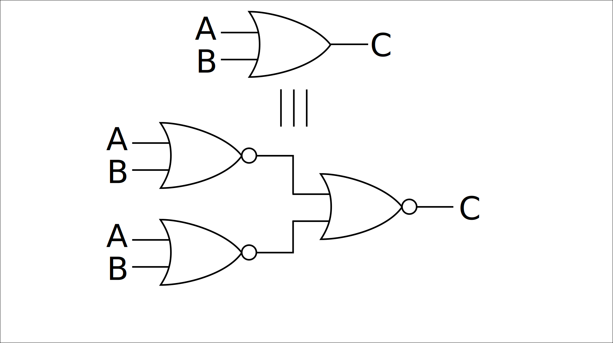

### 心得
熟悉布林代數的運算與用指定的邏輯閘去替代並實現其他邏輯閘的功能，其中lab2和挑戰題的NOR與NAND閘為通用邏輯閘，可以單獨使用來產生其他邏輯閘的所有功能。

<br>

## lab02
### 內容
1. 半加器
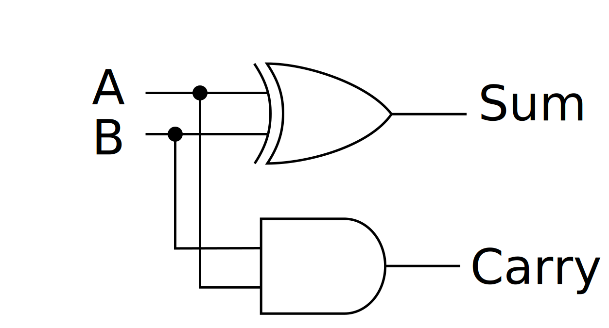
2. 全加器
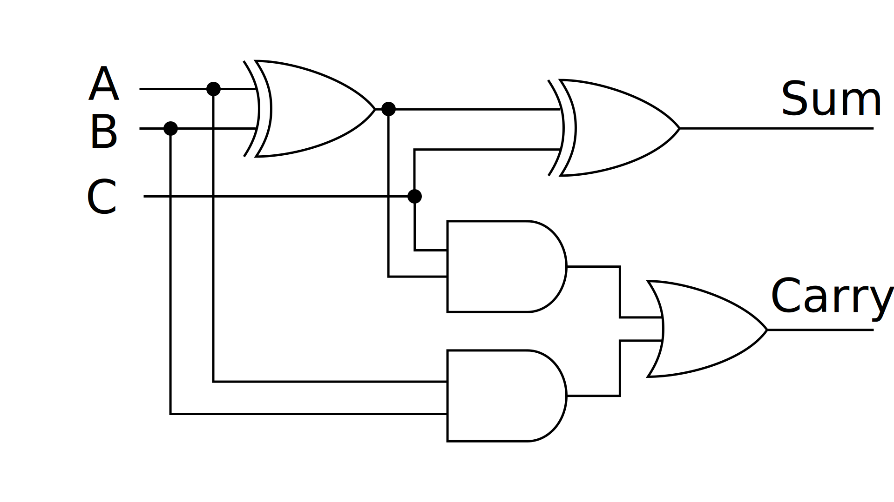
3. 七段顯示器
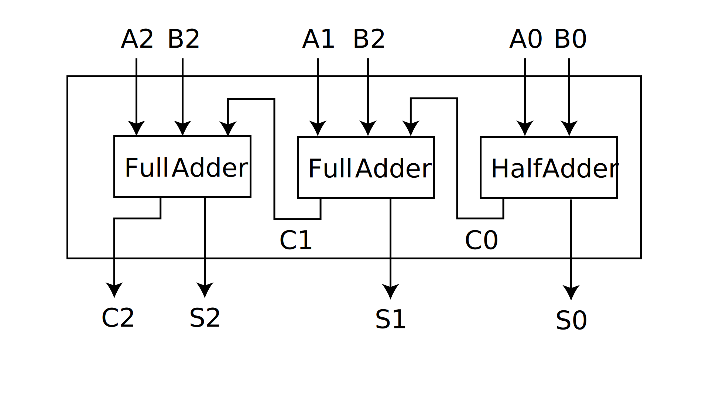
4. 3位元加法器
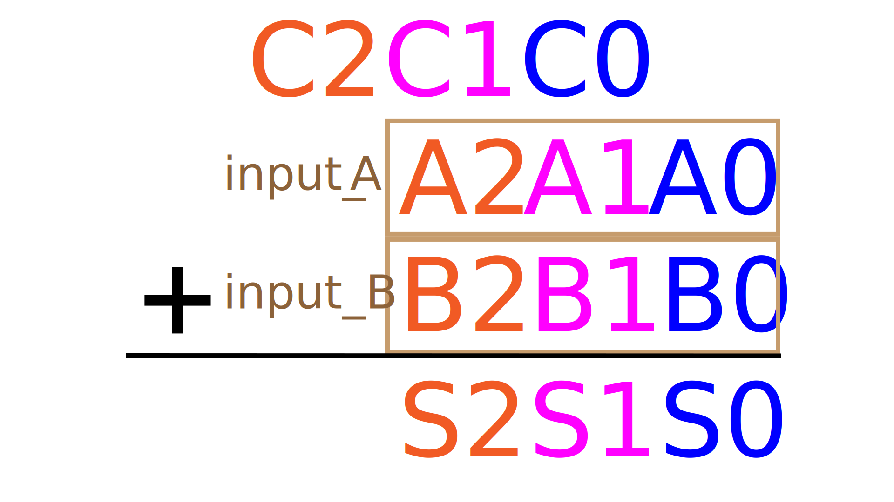
輸入`111`和`110`時，得到13
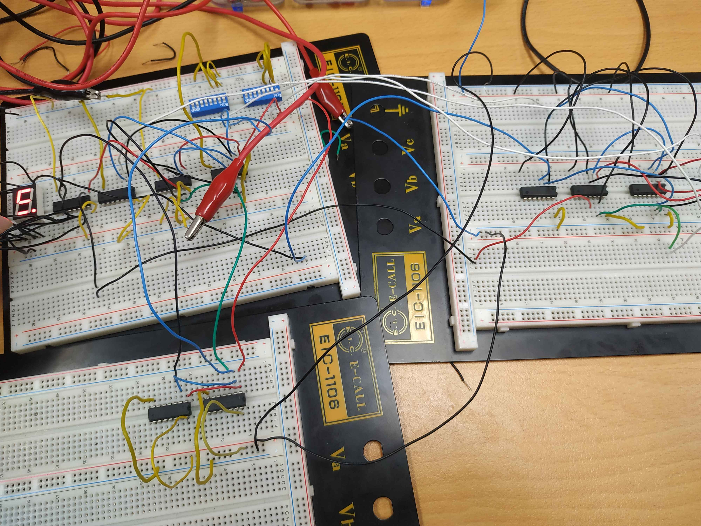


#### 心得
這次實驗是採循序漸進的流程，實驗一是Half Adder、實驗二是Full Adder，而實驗三是七段顯示器，主要花時間卡住的地方有兩個 : 一是搞錯七段顯示器特性，把`COM`接到0V，但本實驗是用共陰極結構，所以`COM`應接5V；二是輸入訊號C、D浮接，由於浮接是屬於**high impedance**，無法確定C、D實際是1還是0，因此造成顯示錯誤，當初debug沒想到花太多時間以至於最後挑戰題沒有接完剩下兩個input A、B的七段顯示器，希望自己能汲取教訓，在下次實驗做快一點。

<br>

## lab03
### 內容
1. Encoder、Decoder<br>
(S0,S1,S2,S3)=(1,0,0,0)
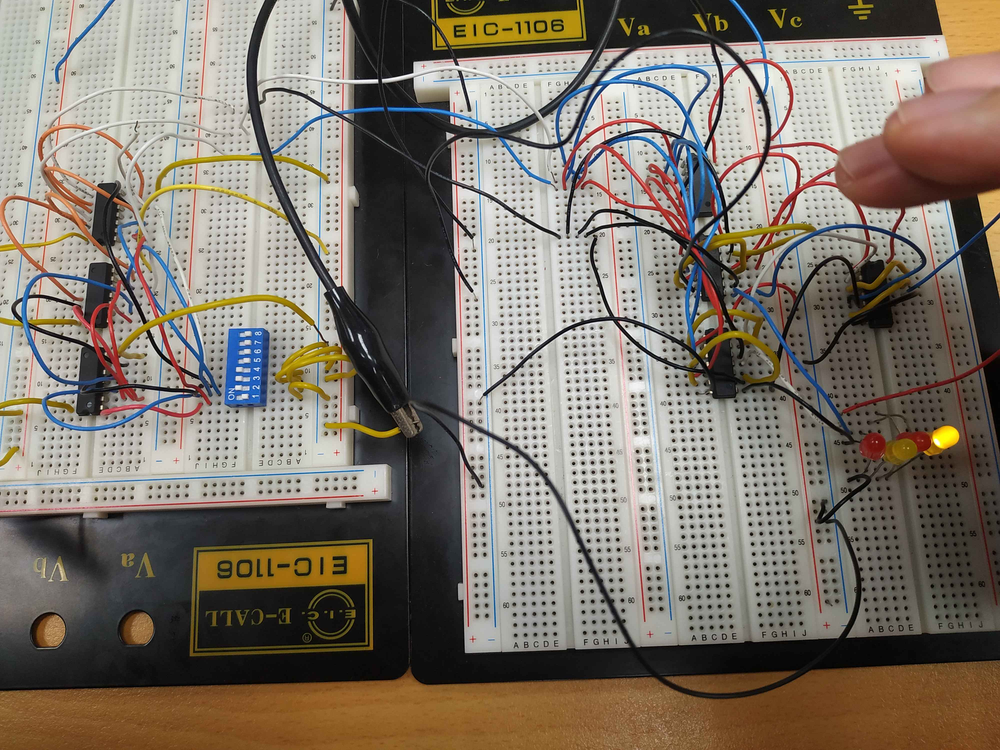
2. MUX、DEMUX<br>

### 心得
- 實作1-1為Priority Encoder，`Priority:S0>S1>S2>S3`。
- 實作1-2為Decoder，輸入2條線(+Enable線一條)，輸出4條到LED上，使我們知道是對應到實驗情境題中訊號作用於哪一個終端設備。
- 實作2為MUX、DEMUX，簡單來說輸入MUX先選哪一條訊號要進channel；輸出DEMUX則是決定channel訊號要輸出到哪一個燈泡上。

<br>

## lab04
### 內容
1. 半加器
2. 全加器
3. 基本邏輯
- 波型
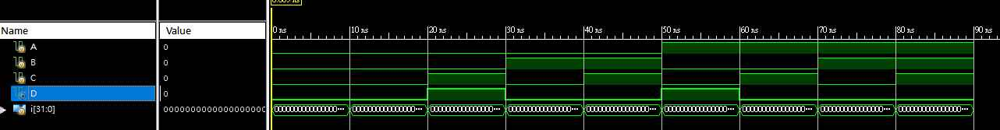
- path delay
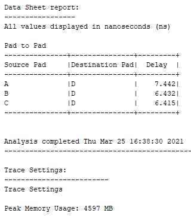
- gate-level diagram
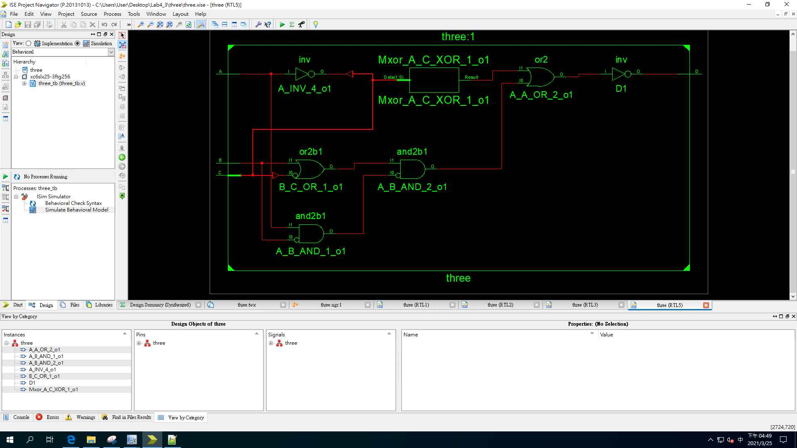

### 心得
這次是使用`Xilinx ISE`的EDA tool(已被`Vivado`取代)進行`Verilog`合成與分析，第一題為半加器、第二題為全加器、第三題為不知道什麼功能的基本邏輯電路，實驗流程:
- 寫`Verilog`與要測試其功能的`testbench`
- 在`Xilinx ISE`下編譯並查看波型是否符合預期結果
- 在`Xilinx ISE`下看report，有`path delay`和實際合成的`gate-level diagram`可以看

算是一堂認識`Verilog`的暖身實驗課。

<br>

## lab05
### 內容
1. 4-bit Adder
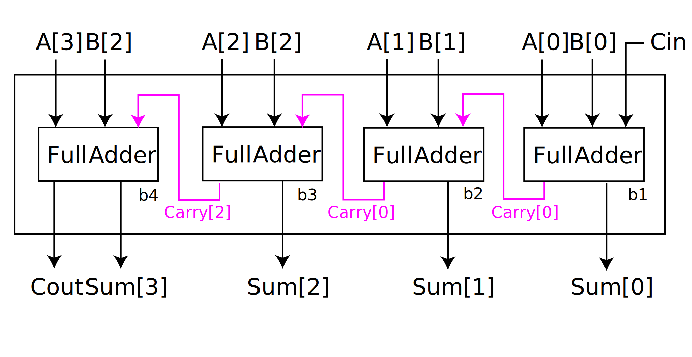
2. 4-bit Ripple Carry Adder
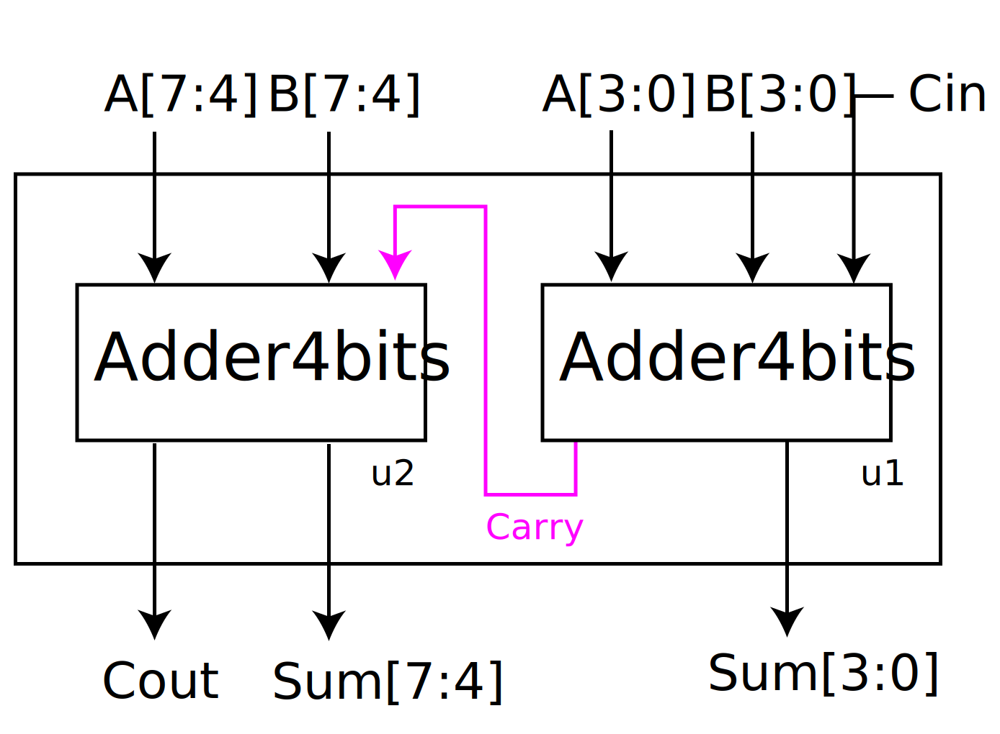
3. 8-bit Carry Select Adder
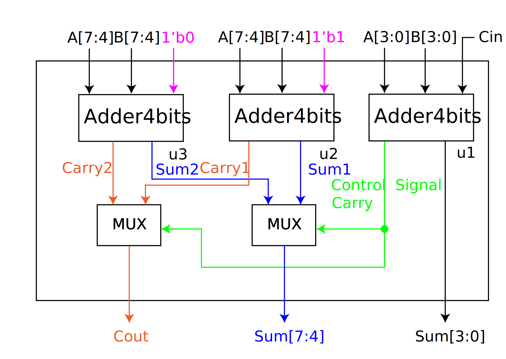

### 心得
延續上次實驗這次一樣打Verilog，由於第一與第二題我與組員分開打，但兩者其實是hierarchical coding的從屬關係，而我又未注意到腳位的順序而導致看Waveform驗證時Sum值為高阻抗(z)即未有輸出值，最後把Module Ports的接法從Position sensitive換成比較保險的Explicitly declared，希望下次我不要再犯這種基本的錯。

<br>

## lab06
### 實驗流程
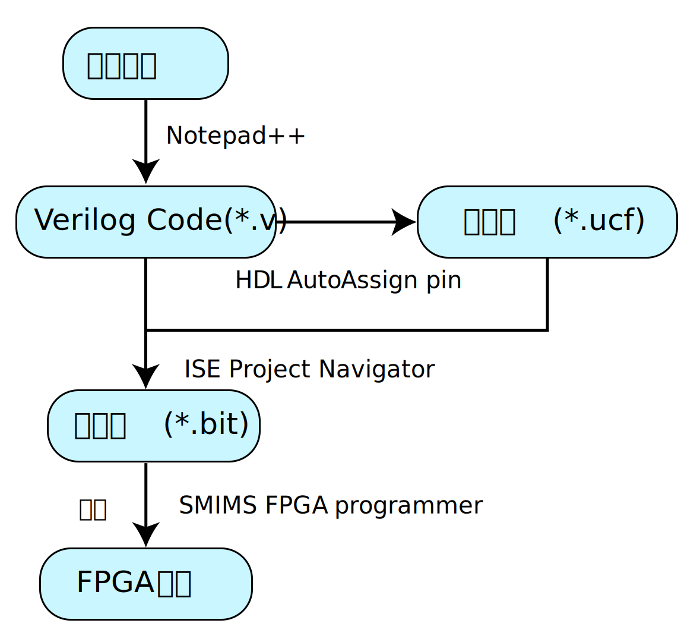

### 內容
1. 指撥開關與LED之使用
2. General I/O
3. 七段顯示器
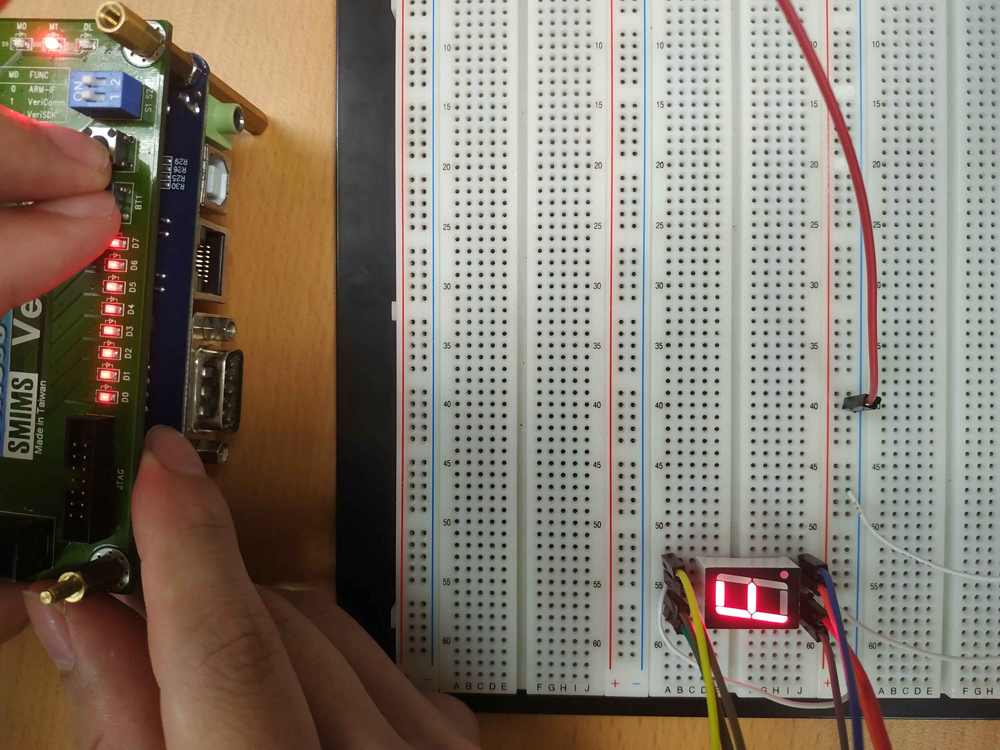

### 心得
`FPGA(Field-Programmable Gate Array)`是現場可編程門陣列的英文縮寫。它是一種靈活的可以根據設計改變內部電路結構的晶片。`FPGA`不僅僅應用於數字電路的實現，它廣泛地應用於`ASIC`原型驗證，嵌入式系統，數位訊號處理等等方面。目前`FPGA`的生產商最大的兩家是AMD的`Xilinx`和Intel的`Altera`，我們使用的就是前者。因此我們不需要跑繁瑣的下晶片流程，加上`FPGA`可重複設計，容錯率、彈性較高。

<br>

## lab07
### 實驗流程
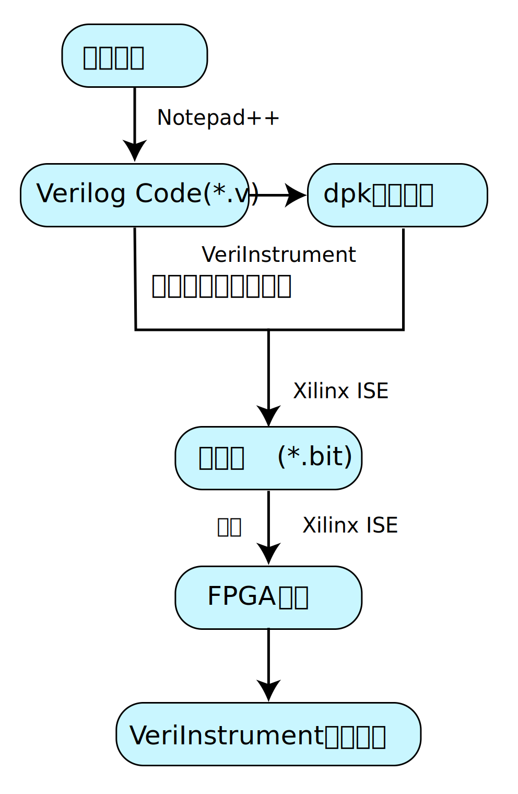

### 內容
1. 指撥開關與LED之使用
2. 七段顯示器
3. 十進位顯示器

### 心得
與上次實驗六一樣皆是用FPGA實作，差別是[SMIMS(北瀚科技)](http://tw.smims.com.tw/index.html)台灣小型公司開發的VeriInstrument軟體工具，雖然一樣是把電路燒到FPGA去做驗證，不過省去我們接線的繁瑣步驟直接使用現成軟體提供的component去模擬。

<br>

## lab08
### 內容
1. 四位元加法器<br>
首先各有2個4-bit的輸入，第一層相加，第二層解碼出顯示器可以正確顯示的訊號。
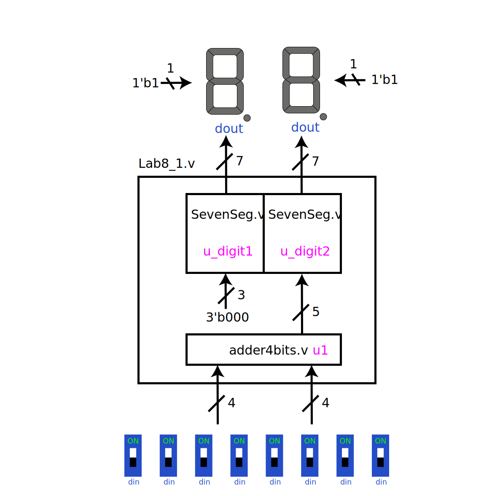

2. 多工器<br>
右下角selection訊號的按鈕用來選擇輸出到雙七段顯示器的值
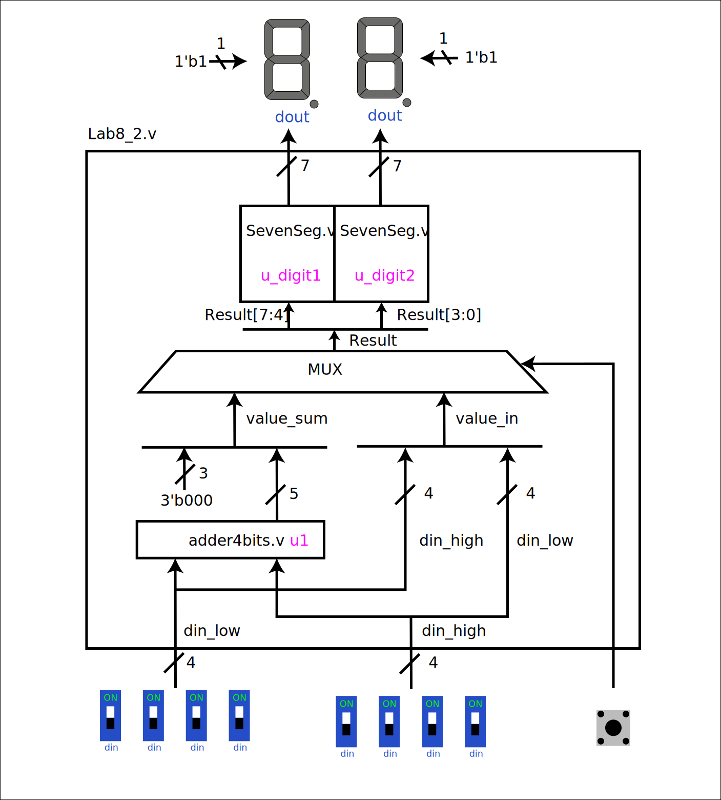

3. case語法應用<br>
用case去列一個個條件，在七段顯示器顯示switch 1-8中的哪個bit被設為1，如果同時有兩個bit以上的switch被設為 1，則七段顯示器顯示0。

4. 比較器<br>
2個輸入輸出至雙七段顯示器。

|一邊值大|兩值相同|
|:-:|:-:|
|那邊小數點會亮|兩邊都不亮|

5. 排序顯示器<br>
輸入的兩個輸入輸出至雙七顯示器，
而`digit1`顯示較大的值、`digit2`顯示較小的值。

### 心得
本次實驗同上次是用`FPGA`加上`VeriInstrument`的實驗流程，一共有五個實作功能的部分
- 四位元加法器(2個4-bit輸入相加)
- 多工器(選擇顯示相加結果或個別輸入)
- Case語法應用(1-bit輸入顯示解碼位置、2-bit以上輸入為0)
- 比較器(2個4-bit輸入比大小)
- 排序顯示器(2個4-bit輸入按照數值大小排序)

<br>

## lab09
### 內容
1.  [D flip flop](https://www.youtube.com/watch?v=dnfXXpW7tIw)
2. [Johnson Counter](https://www.youtube.com/watch?v=X4mx7J1ckyU)
3. [T flip flop](https://www.youtube.com/watch?v=wcfnEla_Y78)
4. [4-bit Asynchronous Up Counter](https://www.youtube.com/watch?v=eEeBh8jfDjg)

### 心得
這次實驗共有兩個部分，一是實作D flip-flop，並以此block進一步實作Johnson Counter；二是實作T flip-flop，並以此block進一步實作4-bit Asynchronous Up Counter。學懂Clk一來會如何變化與接線、回授，如此就了解`johnson_counter.v`與`asyn_counter.v`的工作原理，而在本次實驗我也實際在各個module上接線，搞清楚各個module的功能，並做FPGA燒入與Verilnstrument虛擬裝置的驗證。

<br>

## lab10
### 內容
1. Debounce 電路<br>
由於按鍵屬於機械結構,按下時會有機械彈跳的狀況出現，在0與1之間多次彈跳，因此有兩個做法:一是從軟體程式去下手；而二是從硬體電路下手，設計Debounce電路。
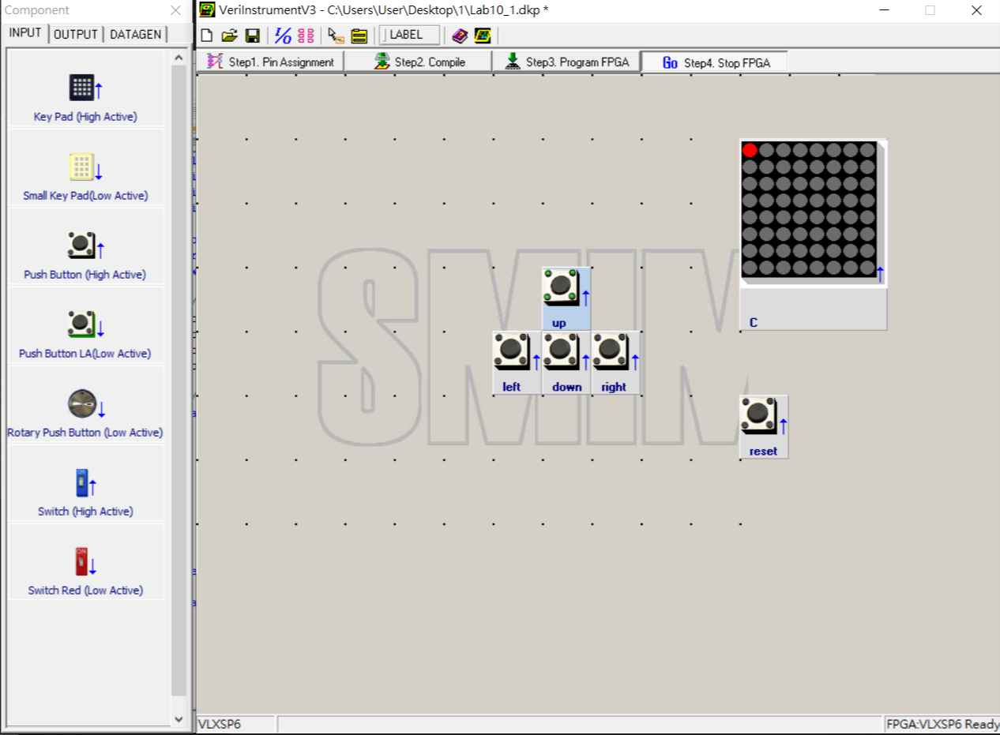

2. 8X8LED矩陣<br>
延續實作一的內容做出`L、O、G、I、C`圖示逐行掃描的類似幻燈片的效果，reset鍵重置顯示第一個字母`L`； 每一次 push button 就顯示下一個文字，到`C`再按下push button則回到`L`。
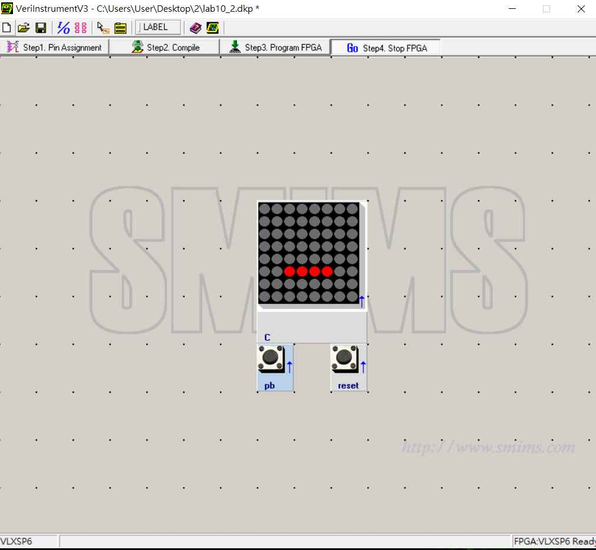

### 心得
這次實驗卡最久的是實作二一開始宣告的位元數錯誤，而又一直沒有發現，以至於最後挑戰題沒能做完，有些可惜。<br>
加上其實這種直接燒到FPGA檢查錯誤的方法，我認為沒有很好debug，如果
寫`top module`相應的`testbench`去跑模擬看波型或許會更有效率去debug。由於**本土疫情延燒**，這次實驗應該是最後一次跑FPGA了，好在也只剩下兩次實驗和Final Project，這個影響已經算小了，希望下學期疫情能回穩，實體上課與做實驗，對我來說學習效率還是比較高的。

<br>

## lab11
### 實驗流程
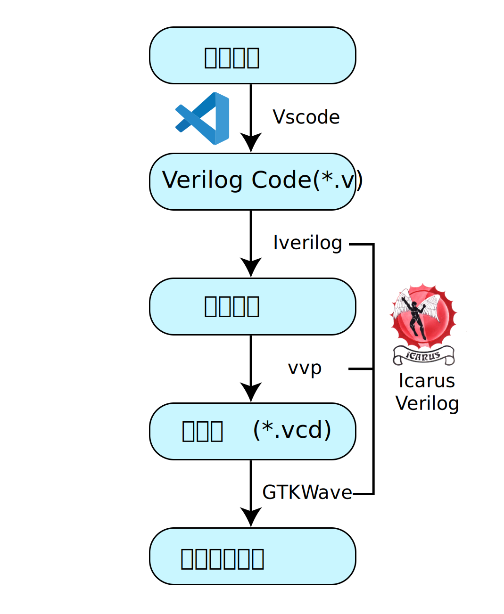
### 內容
1. Half Adder
2. 紅綠燈FSM
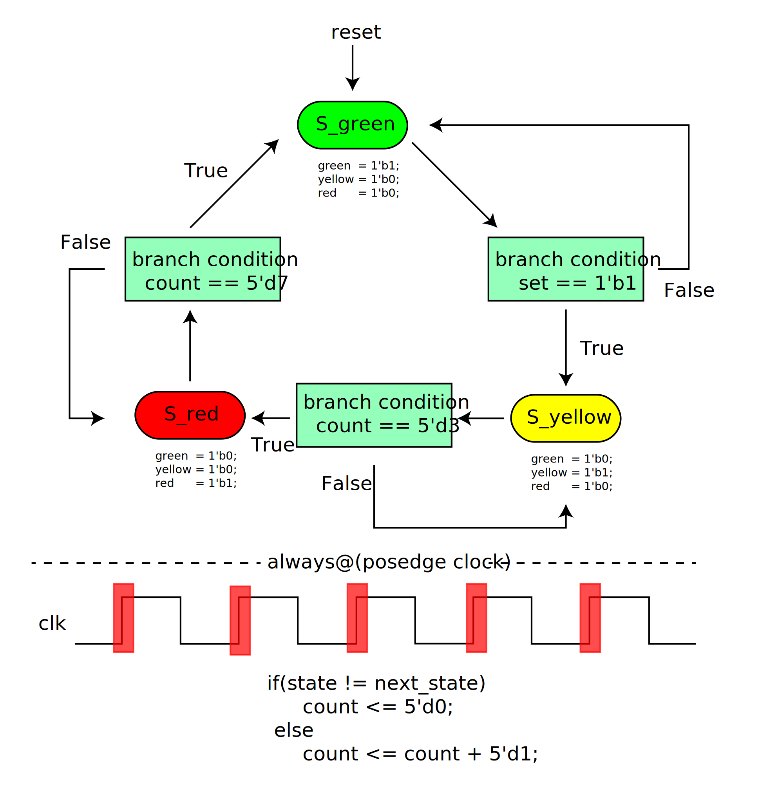


### 心得
由於疫情加劇，實作課改為在家完成，因此不能用FPGA去做電路合成擬真，改用一些免費開源的EDA tools去跑模擬。實驗一沿用Lab4-1 Half Adder的程式去測試實驗環境的安裝，主要學習Icarus Verilog(iverilog+GTKWave)這個仿真工具。

<br>

## lab12
### 內容
1.  Blocking
2. Non-Blocking

## 心得
此次實驗介紹Blocking與Non-Blocking差異，內容相對簡單，我自己也參考了這篇文章[(原創)深入探討blocking與nonblocking (SOC) (Verilog)](https://www.cnblogs.com/oomusou/archive/2010/07/30/blocking_vs_nonblocking.html)，對於兩者之間的差異有了更深入的了解，其中包括event queue的概念: 由於電腦軟體本身是依序執行，但硬體電路卻可併行執行，simulator是軟體寫的，卻要能夠模擬出硬體電路的的並行執行，同時有很多信號被處理，因此需要將同一個time step要處理的信號放在一個event queue，simulator再依序處理，處理完後再處理下一個time step，這樣就能使依序執行的simulator可以模擬出並行執行的硬體電路。


<br>

## lab13
此部分為Final Project內容。 
### 實驗流程
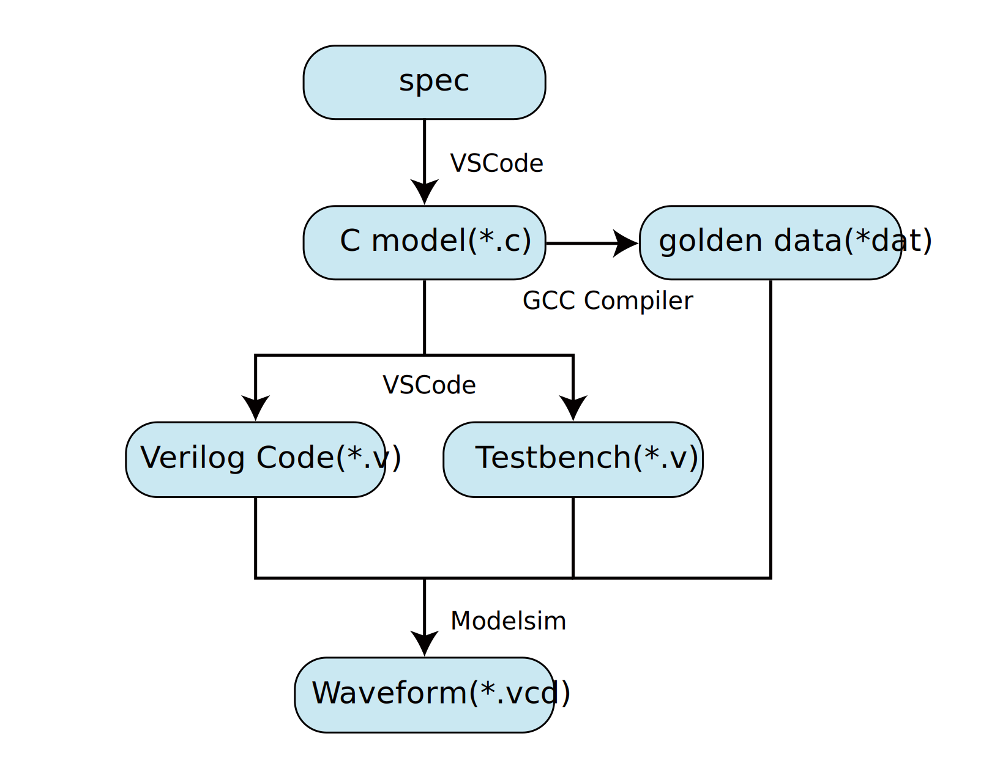

### Specification
`Sequence detector with overlap 2 patterns 010111 or 1101`<br>
偵測連續cycle輸入，當連續4個cycle拿到的值為 1101或是連續6個cycle拿到的值為 010111時，當下cycle就會輸出1。

### C model
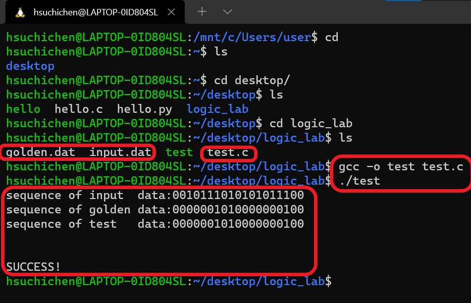

### Verilog Code
1. Input/output port
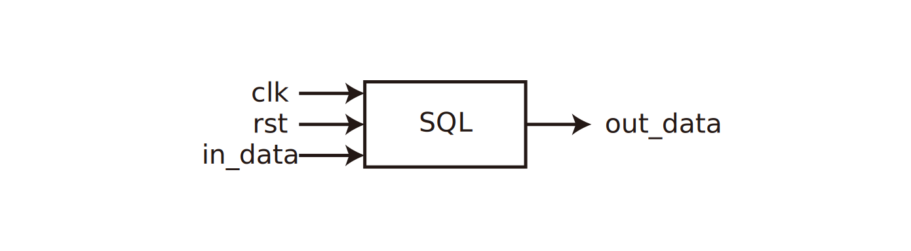
2. State Machine

|PresentState|NS(In_data=0)|NS(In_data=1)|PresentOutput|
|:-:|:-:|:-:|:-:|
|S0|S7|S1|0|
|S1|S2|S1|0|
|S2|S8|S3|0|
|S3|S4|S3|0|
|S4|S5|S3|0|
|S5|S6|S9|0|
|S6|S8|S9|1|
|S7|S8|S1|0|
|S8|S8|S9|0|
|S9|S10|S1|0|
|S10|S8|S3|1|

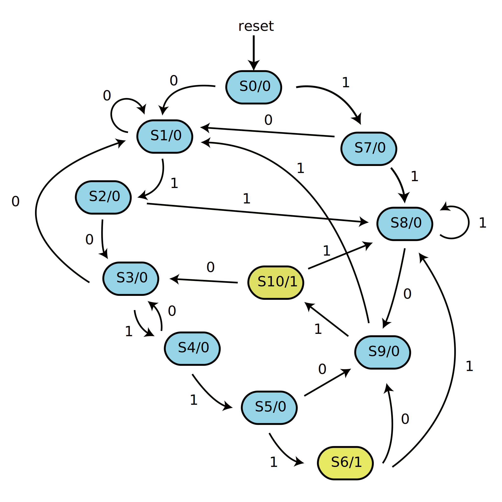
3. block diagrams<br>
採用Moore Machine。


### Testbench
匯入要測試的input.dat與預期得到的golden.dat
```verilog
$readmemh("../others/input.dat",mem_i);                                 
$readmemh("../others/golden.dat",golden);
```
input值在clk一拉起來之前先給，使clk有足夠的set up time能讀入由feedback回來的current_state與in_data組合電路所判斷好得出的next_state。

### Simulation Result
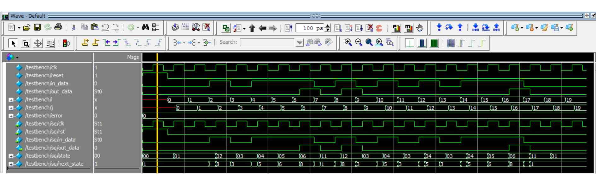
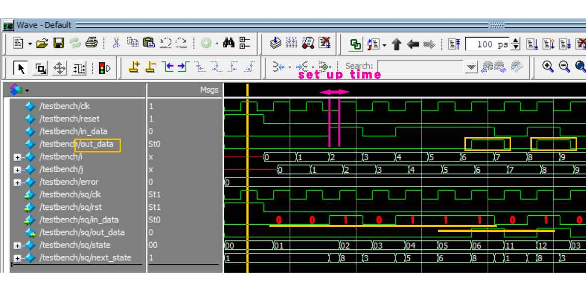
- 如上圖**粉色**，Input早在clk拉起時即給值，clk有足夠的set up time，使得下一個cycle的current_state能讀到由current_state與in_data組合電路所判斷好得出的next_state

- 如上圖**橘色**，由於功能是overlap 2 patterns 010111 or 1101的sequence detector，因此如上圖紅色第一次input_data序列為010111時，state等clk一拉起來進入S6(06)，並輸出out_data為1。而在overlap的情況下，input_data序列為1101時，state等clk一拉起來進入S10(12)，並輸出out_data為1。

- 由上面畫的state machine也可以trace到state之間的變化。以此類推直到測試到序列第19個數字，testbench結束(`$finish`)。

### 心得
本次Final Project為實作上課講的sequence detector，大部分的程式助教其實都打好了，我們只是改個參數而已。除了用state machine實作之外，我其實一開始有想用shift register去存每個bit然後用一個if else的組合電路去判斷，如此做的話就不需要再想state machine了。
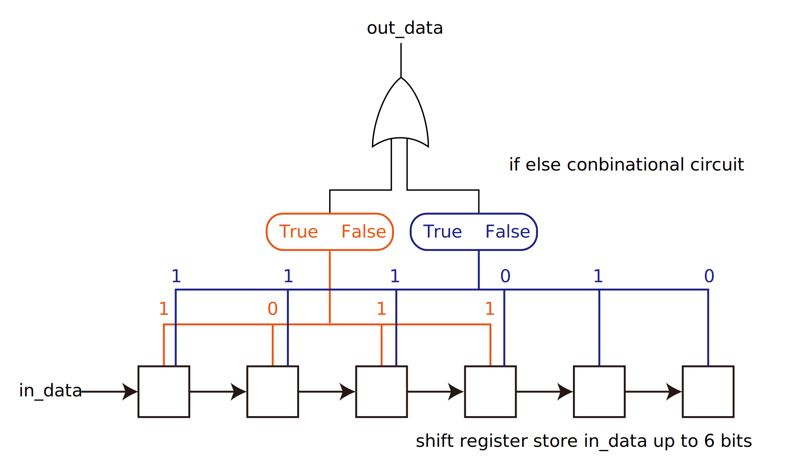